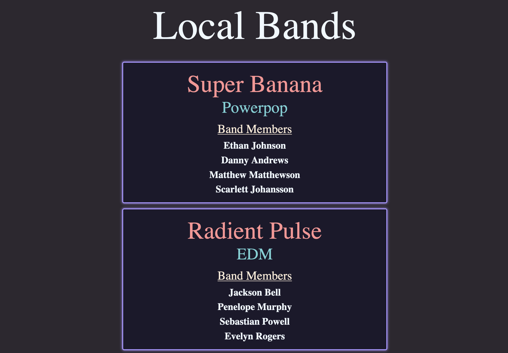
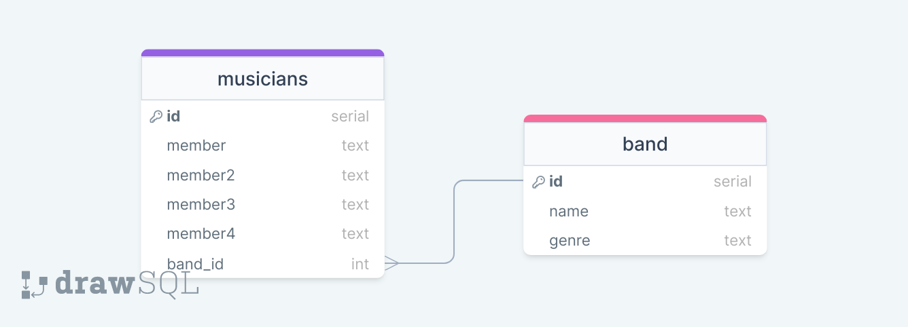

# Fullstack Test

## This time with more relations and less styling.
### Tables

### Routes completed
- [x] Post new band (internal manual request).
- [x] Post new musicians (internal manual request).
- [x] Get all entries from musicians (internal manual request)
- [x] Get all entries from band  (internal manual request)
- [x] Get all entries from bands, which is an inner join. This is what you see on the index.html. It shows the band name, genre, and all the band members.
- [x] Get entry request from bands (internal manual request). 
- [x] Patch band information (internal manual request).
- [x] Patch musicians information (internal manual request).
- [x] Delete band (musicians entry deleted, then band entry to honor foreign key rules) (internal manual request).
### More stuff to do
- [x] Double check to make sure all follow proper REST HTTP methods
